# 图书管理系统

## 队伍分工

罗兴攀 PB19051150 肖玉鹏 PB20000198 曾川铭 PB20000201

分工  1:1:1

初期任务分配：
* 罗兴攀：管理员界面及管理员逻辑业务中的图书管理相关，报告撰写
* 肖玉鹏：读者界面及读者逻辑业务相关，数据库初始化设计
* 曾川铭：管理员逻辑业务中的读者管理相关，登录、注册相关，测试流程设计

后期：互相补充修正

## 需求分析

* 读者：
  * 登录、注册
    * 登录失败提醒
    * 注册信息不符合要求提醒
  * 查看、修改个人信息
    * 重复输入密码不同提醒
    * 输入不符合要求提醒
  * 查看借阅历史
    * 读者在此处还书
  * 搜索书籍，借书、预约书籍
    * 根据违期表等信息获取读者是否可借、可预约，可以时才显示按钮
  * 当读者在违期表中时禁止借阅，直到将违期书籍归还
* 管理员：
  * 登录
    * 系统内置账号和密码：master(123456)
  * 查看、修改个人信息
    * 同上，输入密码检测
  * 搜索、查看、修改学生信息
    * 无法修改读者ID
  * 搜索、查看、修改图书信息
    * 无法修改图书ID
  * 增加、删除图书
    * 不能增加已经存在的书号
    * 不能删除被借出或被预约的书籍
  * 查看借阅信息
    * 可在此处帮学生还书
  * 查看预约信息
  * 查看违期信息
* 共有功能：
  * 书籍搜索：可以根据书名、作者、ID进行查询
  * 读者搜索：根据账户名或姓名搜索
* 特殊需求
  * 支持上传学生和管理员头像
    * 点击输入框打开文件夹选择图片上传

## ER图

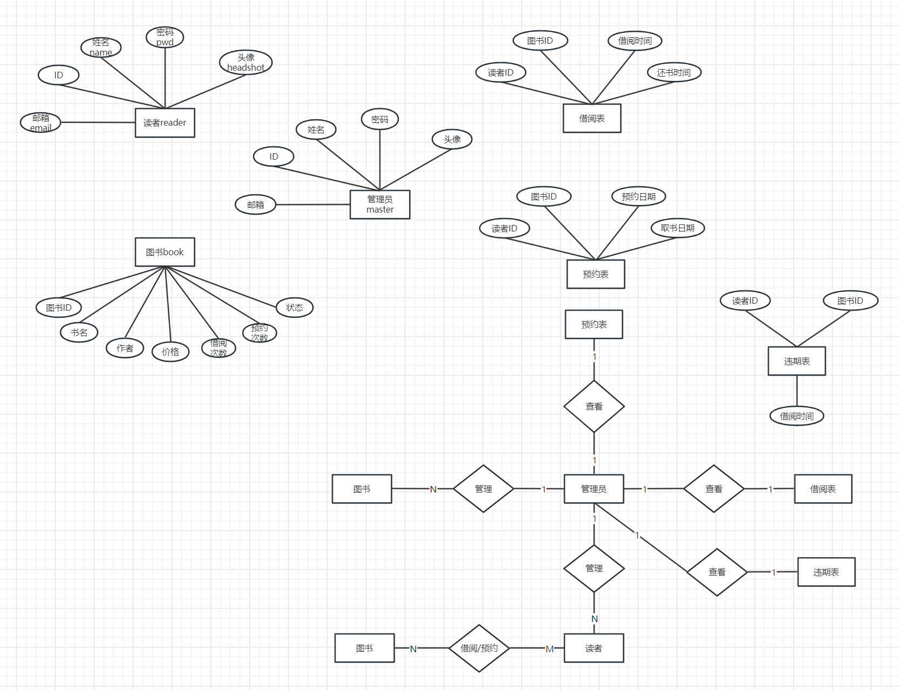

## 数据库模式

数据库模式满足3NF

reader_R(ID,name,email,headshot,pwd)
{ID->name,ID->email,ID->headshot,ID->pwd}:

显然ID为候选码，只有ID为主属性，既没有非主属性对码的局部依赖，也没有非主属性对码的传递依赖，满足3NF

master_R,book_R 同理，满足3NF

borrow_R(reader_ID,book_ID,borrow_Date,return_Date){ {rid,bid}->borrow_Date,{rid,bid}->return_Date}: 

显然{rid,bid}为候选码，{borrow_Date,return_Date}为非主属性，这两个非主属性没有对码的局部依赖，也没有对码的传递依赖，满足3NF

reserve_R和violation_R同理，满足3NF。

## 表设计

master: ID:char(8),name:varchar(10),email:varchar(30),pwd:char(64),headshot:varchar(255)

reader: ID:char(8),name:varchar(10),email:varchar(30),pwd:char(64),headshot:varchar(255)

book: ID:char(8),name:varchar(10),author:varchar(10),price:float,status:int,borrow_Times:int,reserve_Times:int

borrow: reader_ID:char(8),book_ID:char(8),borrow_Date:date,return_Date:date

reserve: reader_ID:char(8),book_ID:char(8),reserve_Date:date,take_Date:date

violation: reader_ID:char(8),book_ID(8),borrow_Date:date

## 系统功能

### 注册

### 登录

登录时，如果有违期记录，发出提醒。确认提醒后可正常登录

## 读者界面
书籍查询、借阅、预约
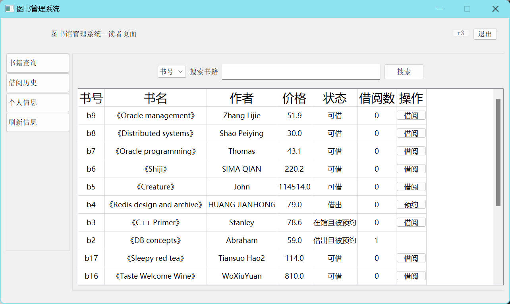
查看借阅历史。归还日期中含“最晚”二字表示，该书尚未归还，后面的日期表示最迟归还日期，预期将被加入违期表
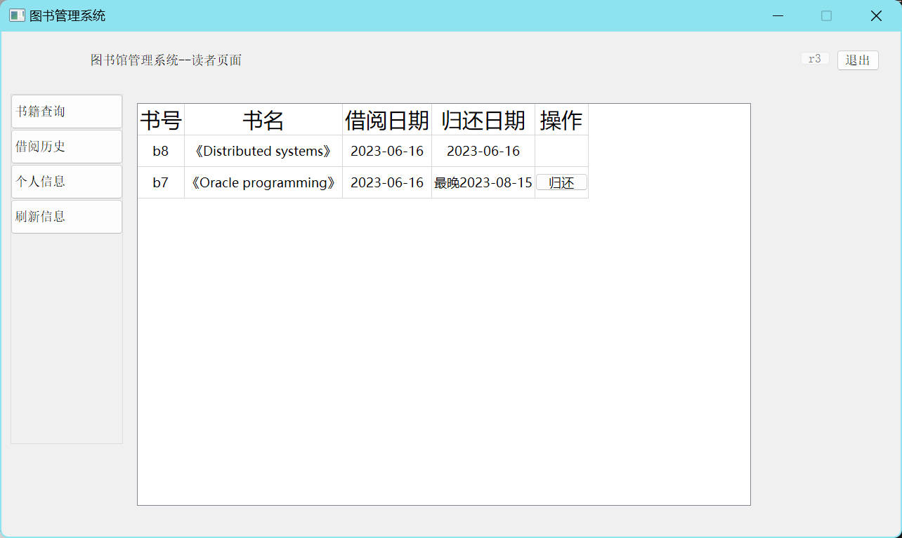
查看、修改个人信息
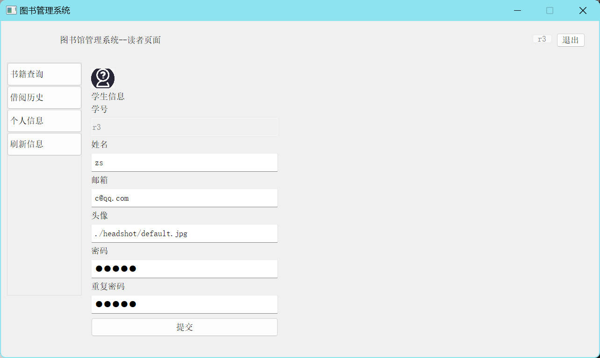

## 管理员界面
图书管理
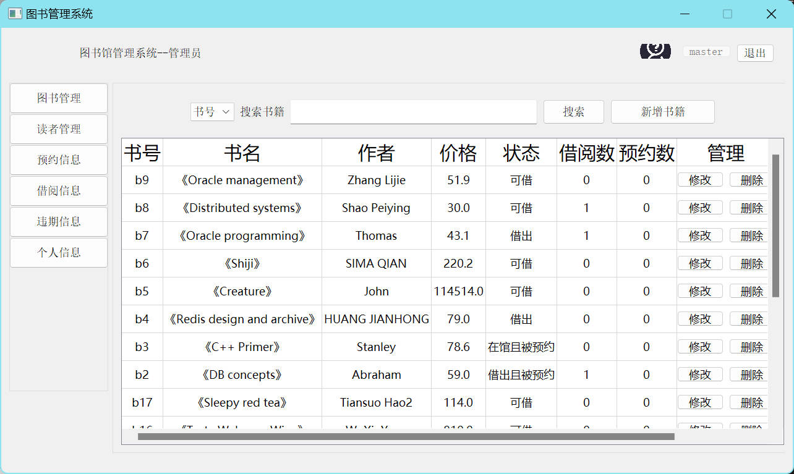
图书修改
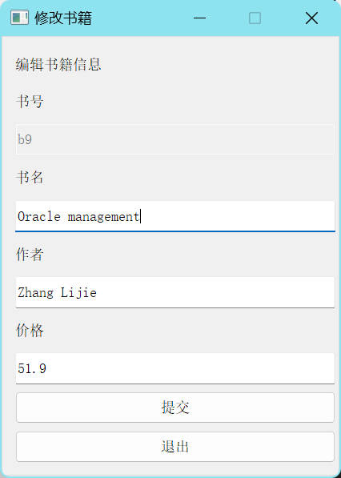
新增图书
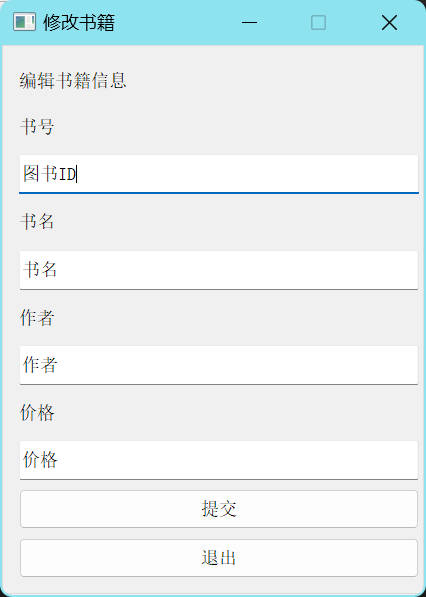
读者管理
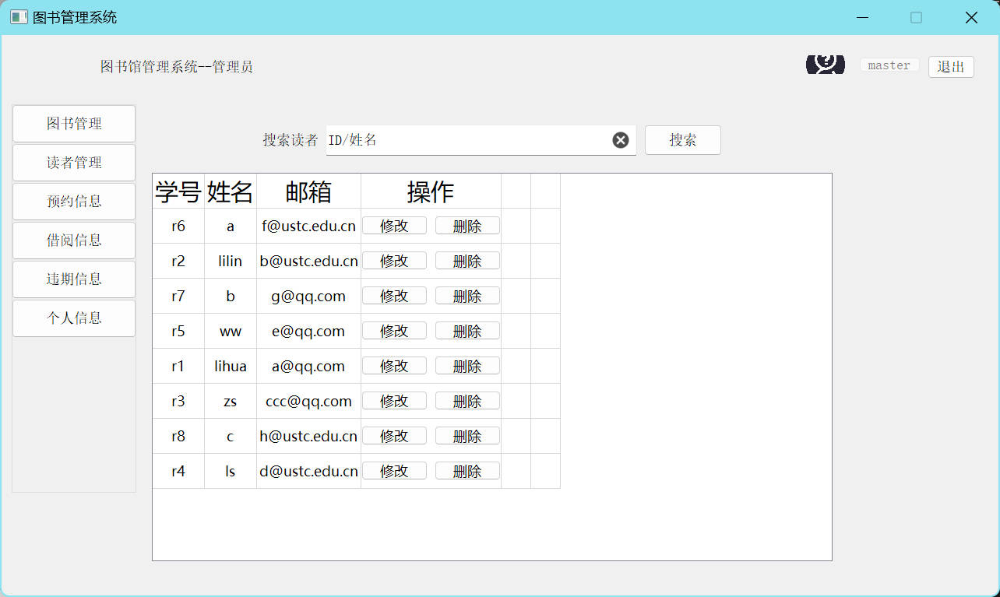
预约信息
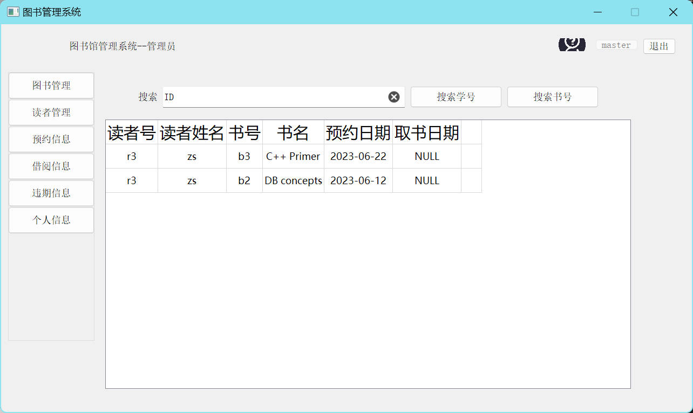
借阅信息
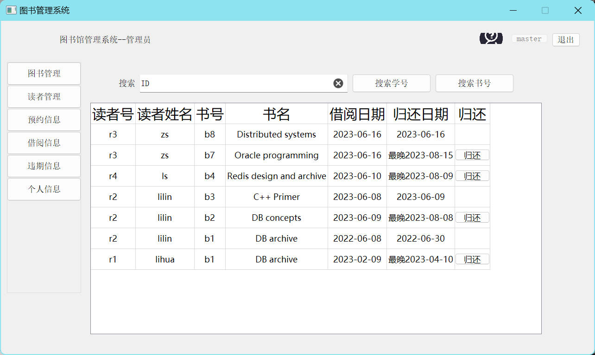
违期信息

管理员信息
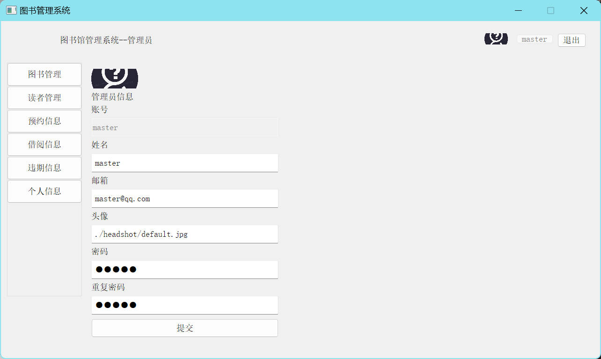

## 加项
1. 读者和管理员均可上传和存储头像
2. 存储器、函数、事务、触发器、视图

存储器：`db.py`中使用`create_procedure_add_book(),create_procedure_delete_book()` 函数创建了两个mysql存储器`add_book,delete_book` 
例如`create_procedure_add_book()`:

视图：`db.py`中使用`create_borrow_view()`等函数，创建了`borrow_view,reserve_view,violation_view` 三个mysql视图

函数：`db.py` 中使用`create_check_function()` 创建了一个mysql函数`check_violation_exists` ,该函数检查读者是否违期，若违期返回1，否则返回0。

事务：项目中在借书、还书、删除书籍等多地方使用到事务,当执行过程全部正确时才`commit()`,否则`rollback()` 